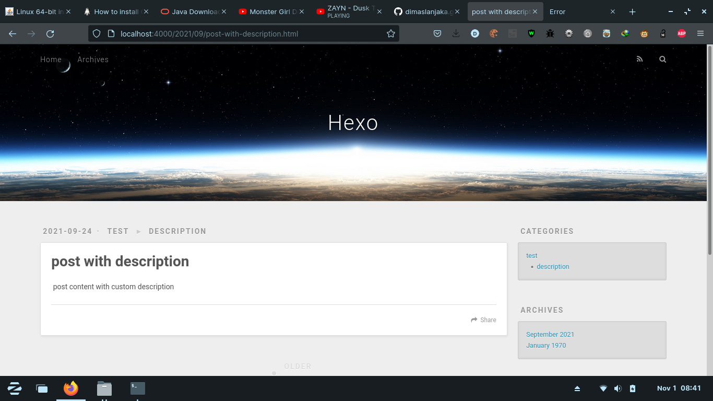

# hexo-blogger-xml
Import content/article from blogger to hexo without losing SEO

# Feature
- Migrate from blogger to hexo
- Migrate blogger permalink to hexo permalink without losing SEO

# Requirements
- Node 12.x 14.x
- Python 2.7 or 3.3
- GCC (node-gyp)
- Typescript (global)
- ts-node (global)
```shell
npm config set python /path/python_dir/python
npm i -g node-gyp typescript ts-node
```

# Installation
Using Git Repository (Development)
```shell
npm i git+https://github.com/dimaslanjaka/hexo-blogger-xml.git
```
Using NPM Repository (Production)
```shell
npm i hexo-blogger-xml
```

# Setup Hexo _config.yml
```yaml
permalink: :title.html # set permalink to title to direct permalink from directory path
pretty_urls: 
  trailing_html: true # Set true to keep `.html` from permalink 

blogger_xml:
  # site title (optional), will set on header.webtitle each post
  site_title: "WMI"
  # default thumbnail if no image in post, will set on header.cover each post
  thumbnail: "https://upload.wikimedia.org/wikipedia/commons/thumb/a/ac/No_image_available.svg/1024px-No_image_available.svg.png"
  # script path relative path from hexo root directory
  callback: "./scripts/post_callback.js" 
  # Your blog domain and subdomain to seo external link, and bellow list is an internal link based on domains
  hostname:
    - "webmanajemen.com"
    - "git.webmanajemen.com"
  # Output directory
  output: "source/_posts"
  # blogger xml path relative path from hexo root directory, you can insert multiple xml
  input:
    - "../xml/test.xml" 
    - "./directory/another.xml" 
```

# Setup .gitignore to your project
```gitignore
# this is build directory of hexo-blogger-xml
build/hexo-blogger-xml
```

# How to export blogger articles/content


# Preview This Plugin
terminal

homepage

permalink: /2021/09/post-with-description.html


## Project with this package
<a href="https://github.com/dimaslanjaka/dimaslanjaka.github.io/tree/compiler" alt="github">Github </a> | 
[dimaslanjaka.github.io](https://dimaslanjaka.github.io)

## Source Code
> [Source Code Compiler](https://github.com/dimaslanjaka/hexo-blogger-xml/tree/compiler)

