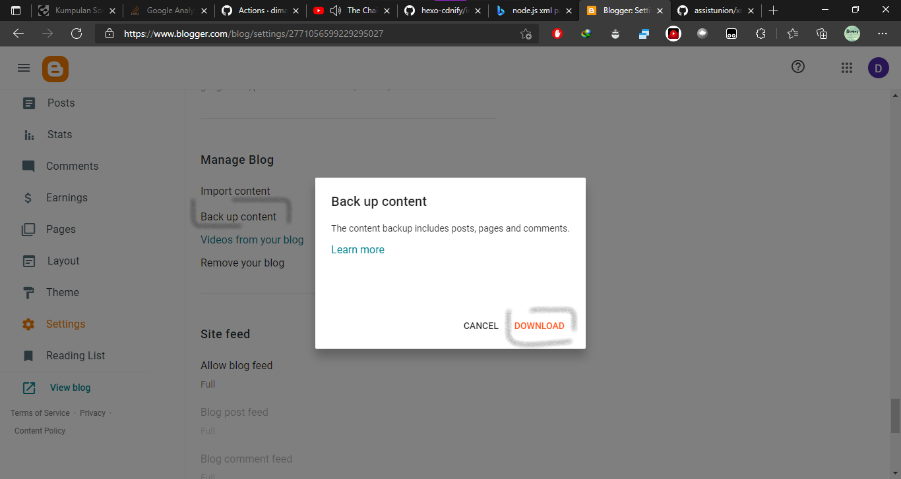

# hexo-blogger-xml
Import content from blogger

# Setup _config.yml
```yaml
permalink: :title.html # set permalink to title to direct permalink from directory path
pretty_urls: 
  trailing_html: true # Set true to keep `.html` from permalink 

blogger_xml:
  # script path relative path from hexo root directory
  callback: "./scripts/post_callback.js" 
  # Your blog domain and subdomain to seo external link, and bellow list is a internal link based on domains
  hostname:
    - "webmanajemen.com"
    - "git.webmanajemen.com"
  # Output directory
  output: "source/_posts"
  # xml path relative path from hexo root directory
  input:
    - "../xml/test.xml" 
    - "./directory/another.xml" 
```

# How to export

