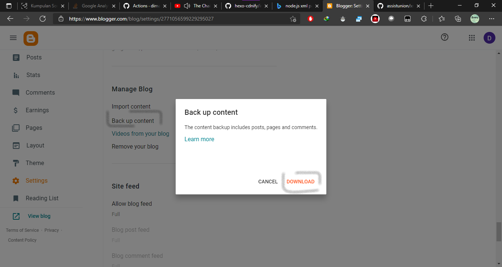

## [1.0.0] - 2021-10-1

- First Publish

## [1.0.1] - 2021-10-1

- Add Support Node 14.x
# hexo-blogger-xml
Import content/article from blogger to hexo

# Feature
- Migrate from blogger to hexo

# Requirements
- Node 12.x 14.x

# Setup _config.yml
```yaml
permalink: :title.html # set permalink to title to direct permalink from directory path
pretty_urls: 
  trailing_html: true # Set true to keep `.html` from permalink 

blogger_xml:
  # script path relative path from hexo root directory
  callback: "./scripts/post_callback.js" 
  # Your blog domain and subdomain to seo external link, and bellow list is a internal link based on domains
  hostname:
    - "webmanajemen.com"
    - "git.webmanajemen.com"
  # Output directory
  output: "source/_posts"
  # blogger xml path relative path from hexo root directory, you can insert multiple xml
  input:
    - "../xml/test.xml" 
    - "./directory/another.xml" 
```

# How to export


## Project with this package
<a href="https://github.com/dimaslanjaka/dimaslanjaka.github.io/tree/compiler" alt="github">Github </a> | 
[dimaslanjaka.github.io](https://dimaslanjaka.github.io)

## Source Code
> [Source Code Compiler](https://github.com/dimaslanjaka/hexo-blogger-xml/tree/compiler)

