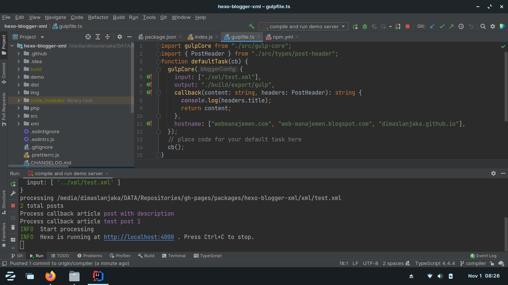
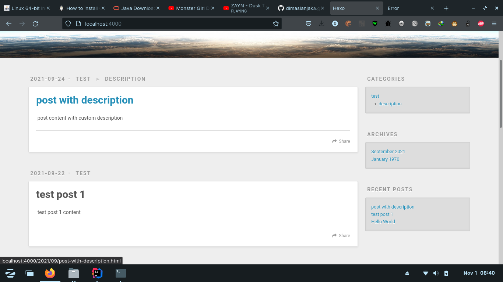
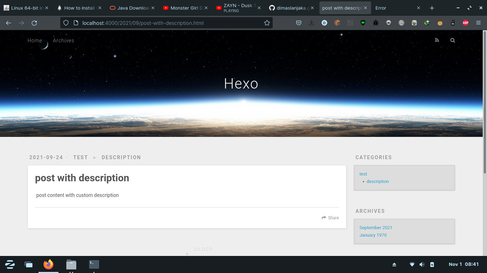

# hexo-blogger-xml
Import content/article from blogger to hexo without losing SEO


# Feature
- Migrate from blogger to hexo
- Migrate blogger permalink to hexo permalink without losing SEO
- Gulp function supported

# Requirements
- Node 12.x 14.x
- Python 2.7 or 3.3
- GCC (node-gyp)
- Typescript (global)
- ts-node (global)
```shell
npm config set python /path/python_dir/python
npm i -g node-gyp typescript ts-node
```

# Installation
Using Git Repository (Development)
```shell
npm i git+https://github.com/dimaslanjaka/hexo-blogger-xml.git
```
Using NPM Repository (Production)
```shell
npm i hexo-blogger-xml
```

# Setup Hexo _config.yml
```yaml
permalink: :title.html # set permalink to title to direct permalink from directory path
pretty_urls:
  trailing_html: true # Set true to keep `.html` from permalink

blogger_xml:
  # site title (optional), will set on header.webtitle each post
  site_title: "WMI"
  # default thumbnail if no image in post, will set on header.cover each post
  thumbnail: "https://upload.wikimedia.org/wikipedia/commons/thumb/a/ac/No_image_available.svg/1024px-No_image_available.svg.png"
  # script path relative path from hexo root directory
  callback: "./scripts/post_callback.js"
  # Your blog domain and subdomain to seo external link, and bellow list is an internal link based on domains
  hostname:
    - "webmanajemen.com"
    - "git.webmanajemen.com"
  # Output directory
  output: "source/_posts"
  # blogger xml path relative path from hexo root directory, you can insert multiple xml
  input:
    - "../xml/test.xml"
    - "./directory/another.xml"
```

# Setup .gitignore to your project
```gitignore
# this is build directory of hexo-blogger-xml
build/hexo-blogger-xml
```

# Using GULP Example
view this repo workflow gulp [gulpfile.ts](./gulpfile.ts)
```typescript
//import gulpCore from "./packages/hexo-blogger-xml/src/gulp-core";
import { gulpCore } from "hexo-blogger-xml";
import path from "path";
gulp.task("blogger", function (done) {
  const mainXML = path.resolve("demo/xml/test.xml");
  gulpCore({
    input: [mainXML],
    output: "./src-posts",
    hostname: ["webmanajemen.com", "www.webmanajemen.com", "dimaslanjaka.github.io"],
    callback: require("./demo/xml/post_callback"),
    on: {
      finish: (parser) => {
        console.log("Blogger gulp finished");
      },
    },
  });

  done();
});
```

# How to export blogger articles/content


# How to keep blogger seo to new domain

- Open blogger theme
- Edit HTML, add below codes to `<head></head>`
```html
<script type='text/javascript'>
  // <![CDATA[
  if (window.location.host == "web-manajemen.blogspot.com") {
    let href = window.location.href;
    let url = new URL(href);
    url.host = "www.webmanajemen.com"; // change your domain host
    url.hostname = "www.webmanajemen.com"; // change your domain host
    let newhref = url.protocol + "//" + url.host + url.pathname + url.search + url.hash;
    window.location.replace(newhref);
  }
  // ]]>
</script>
```

# Preview This Plugin
terminal

homepage

permalink: /2021/09/post-with-description.html


## Source Code
> [Source Code Compiler](https://github.com/dimaslanjaka/hexo-blogger-xml/tree/compiler)

# Website using Hexo NodeJS Blogging System

[](https://github.com/dimaslanjaka/dimaslanjaka.github.io/actions/workflows/page.yml)
[](https://github.com/dimaslanjaka/dimaslanjaka.github.io/tree/compiler)
[](https://webmanajemen.com)

## hexo-adsense
[](https://badge.fury.io/js/hexo-adsense)
[](https://npmjs.com/package/hexo-adsense)
[](https://npmjs.com/package/hexo-adsense)


## hexo-seo
[](https://badge.fury.io/js/hexo-seo)
[](https://npmjs.com/package/hexo-seo)
[](https://npmjs.com/package/hexo-seo)


## hexo-blogger-xml
[](https://badge.fury.io/js/hexo-blogger-xml)
[](https://npmjs.com/package/hexo-blogger-xml)
[](https://npmjs.com/package/hexo-blogger-xml)

# CHANGELOG

## [1.0.0] - 2021-10-1
- First Publish

## [1.0.1] - 2021-10-1
- Add Support Node 14.x

## [1.0.2] - 2021-10-1
- Fix Node 14.x

## [1.0.3] - 2021-10-1
- Add support custom thumbnail and site title

## [1.0.4] - 2021-10-1
- Fix gulp method

## [1.0.7] - 2021-10-1
- Fix no files

## [1.0.8] - 2021-10-1
- Fix broken post header## [1.0.16] November 4, 2021
-86e7c34d : Update changelog
-ea0ccfb0 : Update configuration
-36291bb2 : Update changelog
-1b0ee83c : +changelog

## [1.0.17] November 12, 2021
-25b7ee47 : fix invalid source/__posts to source/_posts

## [1.0.18] November 12, 2021
-6d1e92d3 : Update docs

## [1.0.19] 2021-11-21 22:45:08
-9e7265a7 : fix throwing if configuration not set

## [1.0.20] 2021-11-22 20:40:48
-160b0f75 : migrate xml2js merge2 to dependencies
